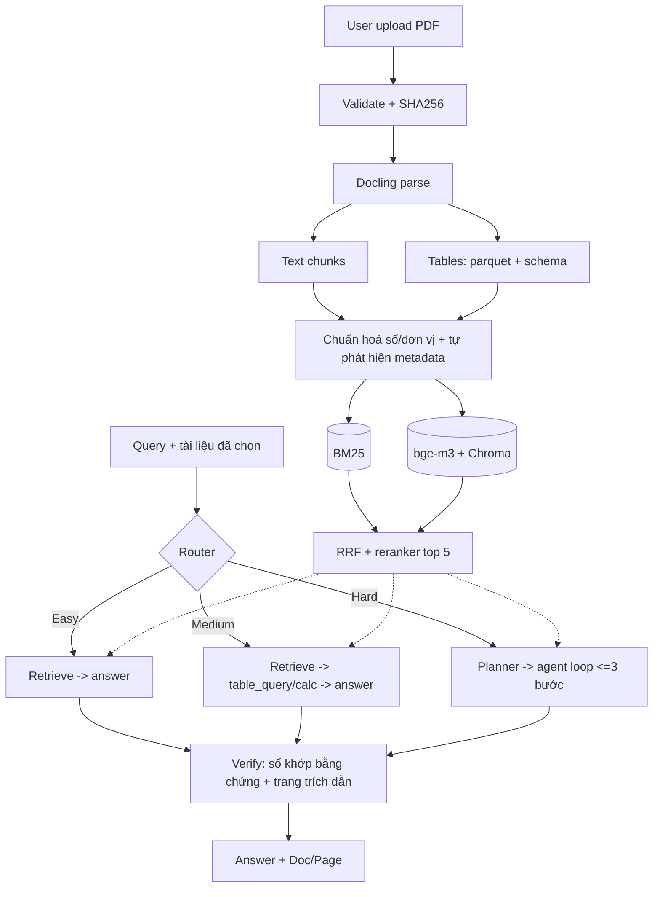

# Adaptive Agentic RAG cho Báo cáo tài chính — Plan v2

Ứng dụng hỏi đáp trên báo cáo tài chính PDF (text + bảng). **Người dùng tự upload PDF làm input**, hệ thống parse, lập chỉ mục, rồi tự chọn mức xử lý theo độ khó của câu hỏi để cân bằng **độ chính xác** và **chi phí (latency, số lần gọi LLM)**. Toàn bộ chạy miễn phí.

Các PDF Vinamilk, FPT, Apple, Tesla chỉ là **dữ liệu đánh giá** (nằm ngoài code ứng dụng), không được hardcode ở đâu trong hệ thống.

---

## 1. Câu hỏi nghiên cứu & benchmark

| RQ | Câu hỏi | Task |
|---|---|---|
| RQ1 | Hybrid (BM25 + dense + RRF + rerank) hơn từng retriever đơn lẻ bao nhiêu? | T8 |
| RQ2 | Table tool giúp câu tính toán chính xác hơn bao nhiêu so với đọc bảng dạng text? | T16 |
| RQ3 | Adaptive giữ được bao nhiêu accuracy của Full-Agentic với bao nhiêu chi phí? | T15–T16 |

**Benchmark 50 câu** trên 4 PDF mẫu = 5 nhóm × 10: Fact, Table filter/groupby, Calculation, Comparison, Multi-hop. Chia **dev 20 / test 30**; tune chỉ trên dev. Test phải có ≥ 1 file **chưa từng dùng khi tune** để kiểm tra khả năng tổng quát hoá sang tài liệu lạ.

**Độ khó định nghĩa theo số vị trí bằng chứng** (không theo từ khoá):
- Easy: 1 vị trí, không tính toán.
- Medium: 1 bảng/1 trang, cần lọc/tra cứu hoặc ≤ 1 phép tính (so sánh 2 năm trong cùng một bảng là Medium).
- Hard: ≥ 2 vị trí (khác trang/khác tài liệu/khác bảng) hoặc tính nhiều bước.

**Metric:** Recall@3/5, MRR (retrieval) · accuracy (số: sai số tương đối ≤ 0.1% sau chuẩn hoá đơn vị; text: khớp chuẩn hoá + chấm tay phần còn lại) · citation match (trang trích dẫn ∈ trang vàng) · hallucination (đáp án chứa số không có trong bằng chứng) · latency API, số call/câu.

Mẫu một câu benchmark:
```json
{"qid":"t-017","split":"test","question":"...","category":"calculation","difficulty":"medium",
 "gold_answer":{"value":12345.6,"unit":"triệu đồng","period":"2024"},
 "gold_evidence":[{"doc_id":"<sha256-hoặc-tên-file>","pages":[12]}]}
```

---

## 2. Yêu cầu phát sinh vì input là PDF người dùng tự đưa vào

1. **Không hardcode** tên công ty, năm, đơn vị, hay cấu trúc bảng. Tất cả được tự phát hiện từ PDF (ngôn ngữ, đơn vị, năm tài chính, hợp nhất/riêng lẻ, tiền tệ); UI cho phép người dùng sửa nếu phát hiện sai.
2. **Cache theo SHA256 của file:** upload lại cùng file thì không parse/embed lại.
3. **Mỗi tài liệu một index riêng**, truy vấn lọc theo `doc_id`; hỗ trợ chọn nhiều tài liệu và câu hỏi so sánh giữa các file.
4. **Xử lý chậm:** Docling + bge-m3 trên CPU tốn thời gian → chạy nền, có progress bar, giới hạn kích thước/số trang (ngưỡng chốt bằng số đo ở T2).
5. **Song ngữ:** phát hiện ngôn ngữ từng tài liệu để chọn tokenizer (tiếng Việt cần tách từ); prompt/router chạy được cả VN và EN; trả lời theo ngôn ngữ câu hỏi.
6. **Kiểm tra đầu vào:** file hỏng, mã hoá, PDF scan không có text → báo lỗi rõ ràng (hoặc OCR nếu khả thi) thay vì trả kết quả rác.
7. **Nội dung PDF là dữ liệu không tin cậy:** tách rõ trong prompt, tool chỉ nhận DSL JSON, không thực thi gì sinh ra từ nội dung tài liệu.
8. **Riêng tư:** nội dung file đi qua API LLM free-tier; hiện cảnh báo trong UI và kiểm tra điều khoản sử dụng dữ liệu của gói miễn phí.

---

## 3. Tech stack (0đ)

| Thành phần | Chọn | Ghi chú |
|---|---|---|
| Parser PDF + bảng | Docling (local) | Thử trên PDF tiếng Việt thật ở T2 |
| Dense embedding | `BAAI/bge-m3` | Qua `sentence-transformers` (FastEmbed Python không có model này) |
| Reranker | `bge-reranker-v2-m3` | Qua `sentence-transformers` (FastEmbed Python không có) |
| Sparse | `rank-bm25` + tách từ VN (`underthesea`/`pyvi`) | Tách theo khoảng trắng sẽ cắt đôi "doanh thu" |
| Vector DB | ChromaDB persist | Một collection/thư mục cho mỗi tài liệu |
| LLM | Gemini Flash (model id trong config) + Groq (dự phòng/dev) | Đọc quota thật trong AI Studio; Groq 8B chỉ 6K token/phút → không dùng cho benchmark chính |
| Table sandbox | pandas + DSL JSON + AST calculator | Không `eval/exec` chuỗi do LLM sinh |
| Cache | `diskcache`/SQLite | Lưu cả latency và token gốc |
| UI | Streamlit | Community Cloud chỉ ~2.7 GB RAM, không chứa nổi bge-m3 + reranker + Docling → chạy local hoặc HF Spaces (16 GB, cần kiểm tra Space miễn phí) |

---

## 4. Kiến trúc & 4 pipeline



| Pipeline | Retrieval | Agent | Router |
|---|---|---|---|
| P0 Baseline | Dense only | – | – |
| P1 Hybrid | BM25+Dense+RRF+rerank | – | – |
| P2 Full-Agentic | Hybrid | mọi câu | – |
| P3 Adaptive | Hybrid | chỉ nhánh Hard | rules hoặc LLM |

Router: `rules` (regex số năm/từ khoá so sánh/số tài liệu được chọn, 0 call) và `llm` (structured output, có cache); so sánh cả hai với **oracle** (dùng nhãn vàng) để biết cận trên.

---

## 5. Cấu trúc thư mục

```
adaptive-financial-rag/
├── README.md
├── requirements.txt
├── .env.example                 # GEMINI_API_KEY, GROQ_API_KEY
├── .gitignore                   # data/eval_docs, data/store, data/cache
├── Makefile                     # ingest | bench | ablate | report | app | test
│
├── configs/
│   └── default.yaml             # model id, top_k, rrf_k, max_steps=3, giới hạn file/trang, RPM/TPM/RPD
│
├── data/
│   ├── eval_docs/               # 4 PDF mẫu CHỈ để đánh giá + SOURCES.md
│   ├── store/<sha256>/          # mỗi tài liệu: parsed.md, tables/*.parquet + *.schema.json, meta.json, index/
│   ├── cache/                   # llm_cache.sqlite
│   └── benchmark/
│       ├── dev.jsonl            # 20 câu
│       └── test.jsonl           # 30 câu (đóng băng)
│
├── src/finrag/
│   ├── schemas.py               # Document, Chunk, Table, Evidence, AgentStep, Answer
│   ├── documents/
│   │   └── registry.py          # thêm/xoá/liệt kê tài liệu, tra theo SHA256, trạng thái xử lý
│   ├── ingestion/
│   │   ├── validate.py          # kích thước, số trang, mã hoá, có text hay không
│   │   ├── docling_parser.py    # PDF -> markdown + bảng, giữ số trang
│   │   ├── table_extractor.py   # DataFrame + schema (cột, kỳ, đơn vị), nối bảng nhiều trang
│   │   ├── numeric_normalizer.py# 1.234,5 <-> 1,234.5; (123) = âm; triệu/tỷ đồng
│   │   ├── metadata_detector.py # ngôn ngữ, đơn vị, năm tài chính, hợp nhất/riêng lẻ, tiền tệ
│   │   ├── chunker.py           # heading path; bảng là 1 đơn vị
│   │   └── pipeline.py          # ingest_document(pdf) -> Document (có cache theo SHA256)
│   ├── retrieval/
│   │   ├── tokenizer_vi.py
│   │   ├── bm25_index.py
│   │   ├── dense_index.py
│   │   ├── fusion.py            # RRF tự viết (~15 dòng)
│   │   ├── reranker.py
│   │   └── hybrid.py            # search(query, doc_ids, filters)
│   ├── llm/
│   │   ├── client.py            # generate(), generate_json(schema)
│   │   ├── rate_limiter.py      # token bucket + retry-after + backoff
│   │   └── cache.py             # khoá = hash(model, prompt, schema); lưu response, usage, latency gốc
│   ├── tools/
│   │   ├── table_query.py       # thực thi DSL JSON
│   │   └── safe_calc.py         # AST evaluator: + - * / ** %, pct_change
│   ├── router/
│   │   ├── rules.py
│   │   ├── llm_router.py
│   │   └── oracle.py
│   ├── agent/
│   │   ├── react_loop.py        # planner + loop, tối đa 3 bước; tools: search, table_query, calc, finish
│   │   └── prompts/
│   ├── verify.py                # numeric grounding + citation check (không tốn LLM call)
│   └── pipelines/               # baseline.py, hybrid.py, agentic.py, adaptive.py
│
├── evaluation/
│   ├── metrics.py
│   ├── run_retrieval_eval.py    # RQ1
│   ├── run_benchmark.py         # --pipeline --split ; ghi JSONL append-only
│   ├── run_ablation.py
│   ├── make_report.py          # bảng kết quả + CI bootstrap
│   ├── results/                 # <run_id>.jsonl (git sha, config, model id, ngày)
│   └── error_analysis/
│       ├── error_taxonomy.csv
│       └── error_analysis.md
│
├── scripts/
│   └── build_index.py           # ingest hàng loạt PDF mẫu (chạy được trên Colab)
│
├── app/
│   ├── app.py                   # Streamlit: upload PDF, danh sách tài liệu, chọn tài liệu, hỏi, badge route, trace, đáp án + [Doc, Page]
│   └── components/
│
└── tests/
    ├── test_rrf.py
    ├── test_numeric_normalizer.py
    ├── test_safe_calc.py
    ├── test_table_query_sandbox.py   # có ca tấn công: __import__, __class__
    └── test_ingest_validate.py       # file hỏng / mã hoá / scan
```

DSL cho table tool (LLM chỉ sinh JSON này, code cục bộ thực thi):
```json
{"table_id":"<doc>_p12_t1","op":"select","rows":{"label_contains":"doanh thu thuần"},"cols":["2024","2023"]}
{"op":"calc","expr":"(a-b)/b*100","vars":{"a":"cell:r1c1","b":"cell:r1c2"}}
```

---

## 6. Danh sách task (làm tuần tự từ T1 đến T19)

Mỗi task chỉ bắt đầu khi task trước đó đã đạt mục **Xong khi**. Tổng ước lượng ~146 giờ (≈ 16 tuần nếu 9 giờ/tuần).

### Nhóm A — Nền móng

**T1. Khung dự án + LLM client** (~5h) · Phụ thuộc: không
- Tạo repo, môi trường Python 3.11, `configs/default.yaml`, `Makefile`.
- Viết `llm/client.py`, `rate_limiter.py`, `cache.py` (cache lưu response + usage + latency gốc).
- Lấy Gemini API key; đọc quota thật trong AI Studio và Groq console.
- *Xong khi:* gọi Gemini một prompt; gọi lại lần 2 lấy từ cache với 0 API call nhưng vẫn báo latency/token gốc.

**T2. Kiểm tra khả thi** (~5h) · Phụ thuộc: T1
- Chạy Docling thử trên PDF tiếng Việt và tiếng Anh thật: bảng có gãy cột không, có lỗi font phải OCR không, bao nhiêu giây/trang.
- Chạy `TextEmbedding.list_supported_models()` của FastEmbed để xác nhận; đo RAM và tốc độ bge-m3 + reranker trên CPU và Colab.
- Chốt giới hạn upload (MB, số trang) dựa trên số đo.
- *Xong khi:* ghi lại quyết định dùng/không dùng từng thành phần và ngưỡng upload vào README (mục Hạn chế).

### Nhóm B — Ingestion (PDF người dùng đưa vào)

**T3. Ingestion 1: validate → parse → bảng** (~12h) · Phụ thuộc: T2
- `validate.py`, `docling_parser.py`, `table_extractor.py`, `documents/registry.py`; cache theo SHA256; lưu vào `data/store/<sha256>/`.
- Bảng lưu `.parquet` + `schema.json`; nối bảng kéo dài nhiều trang; giữ số trang cho mọi chunk/bảng.
- Test `test_ingest_validate.py`: file hỏng, mã hoá, scan.
- *Xong khi:* `ingest_document(pdf)` chạy trên 4 PDF mẫu và trên 1 PDF khác chưa từng thấy; upload lại cùng file trả kết quả tức thì.

**T4. Ingestion 2: chuẩn hoá, metadata tự động, chunking** (~8h) · Phụ thuộc: T3
- `numeric_normalizer.py` (+ test), `metadata_detector.py` (ngôn ngữ, đơn vị, năm tài chính, hợp nhất/riêng lẻ, tiền tệ), `chunker.py` (heading path, bảng là 1 đơn vị); metadata mỗi chunk: `doc_id, page, chunk_id, content_type, unit, fiscal_year, language`.
- Chấm tay 20 bảng ngẫu nhiên để có tỉ lệ parse đúng (dùng lại ở T17).
- *Xong khi:* metadata phát hiện đúng trên tất cả tài liệu thử; không còn tên công ty/năm nào hardcode.

### Nhóm C — Retrieval

**T5. Index theo từng tài liệu** (~7h) · Phụ thuộc: T4
- `tokenizer_vi.py`, `bm25_index.py`, `dense_index.py` (bge-m3 + Chroma persist), lưu index trong thư mục của tài liệu; xoá tài liệu thì xoá luôn index.
- *Xong khi:* thêm/xoá tài liệu trong registry mà index luôn nhất quán; xử lý nền có báo tiến độ.

**T6. Hybrid retrieval** (~7h) · Phụ thuộc: T5
- `fusion.py` (RRF, có test), `reranker.py`, `hybrid.py: search(query, doc_ids, filters)` gộp kết quả nhiều tài liệu.
- *Xong khi:* 5 câu hỏi mẫu trả về đúng trang; tìm được trên nhiều tài liệu cùng lúc.

### Nhóm D — Benchmark dev & đo retrieval

**T7. Soạn benchmark dev (20 câu)** (~8h) · Phụ thuộc: T6
- 20 câu phủ đủ 5 nhóm, gán độ khó theo định nghĩa mục 1, gán đáp án vàng + trang vàng.
- *Xong khi:* `dev.jsonl` hợp lệ theo schema.

**T8. RQ1: đo retrieval** (~5h) · Phụ thuộc: T7
- `metrics.py` (phần retrieval), `run_retrieval_eval.py`. So sánh BM25 / Dense / Hybrid / Hybrid + rerank; tách text vs table và VN vs EN.
- *Cổng 1:* Recall@5 của Hybrid + rerank còn thấp (ví dụ < 0.7) thì quay lại sửa T3–T6 trước khi làm tiếp.

### Nhóm E — Sinh đáp án, tool, agent

**T9. Harness đánh giá + P0/P1** (~9h) · Phụ thuộc: T8
- Hoàn tất `metrics.py` (accuracy, citation, hallucination, cost), `run_benchmark.py`, pipeline P0 và P1 chạy trên dev.
- *Xong khi:* một lệnh chạy dev cho P0/P1 ra bảng kết quả; chạy lại lần 2 hoàn toàn từ cache.

**T10. Table tool** (~9h) · Phụ thuộc: T9
- `safe_calc.py` (AST), `table_query.py` (DSL). Viết test bảo mật trước (`test_safe_calc.py`, `test_table_query_sandbox.py`).
- *Xong khi:* toàn bộ test xanh; không có đường `eval/exec` nào trong `tools/`.

**T11. Verify** (~5h) · Phụ thuộc: T9
- `verify.py`: mọi số trong đáp án phải khớp bằng chứng/kết quả tool; trang trích dẫn phải chứa bằng chứng; không đủ bằng chứng thì retrieve lại tối đa 1 lần.
- *Xong khi:* bắt được các ca đáp án bịa số trên dev.

**T12. Agent loop → P2 Full-Agentic** (~10h) · Phụ thuộc: T6, T10, T11
- `react_loop.py`: tối đa 3 bước, bước đầu gộp phân rã sub-query để tiết kiệm call; tools `search / table_query / calc / finish`; trần call mỗi câu.
- *Xong khi:* P2 chạy hết dev, log đủ từng bước, không vòng lặp vô hạn.

**T13. Router → P3 Adaptive** (~8h) · Phụ thuộc: T12
- `rules.py`, `llm_router.py` (có cache), `oracle.py`; ghép P3; nếu verify thất bại thì nâng lên nhánh cao hơn một lần.
- *Cổng 2 (MVP):* P0–P3 chạy end-to-end trên dev, có bảng kết quả sơ bộ.

### Nhóm F — Thực nghiệm

**T14. Soạn test set (30 câu) và đóng băng** (~9h) · Phụ thuộc: T13
- Viết test set (gồm ≥ 1 file chưa từng dùng khi tune) **trước khi** xem kết quả pipeline trên nó; đọc lại nhãn một lượt để sửa sai; gắn tag git.
- *Xong khi:* `test.jsonl` đóng băng, ước lượng số call một lượt quét đầy đủ để lên lịch theo quota ngày.

**T15. Chạy chính P0–P3 trên test** (~6h) · Phụ thuộc: T14
- Cùng một model id cho cả 4 pipeline. `make_report.py` xuất bảng theo nhóm + tổng, kèm n và CI bootstrap.
- *Xong khi:* có bảng Accuracy / Citation / Hallucination / Latency / Calls cho 4 pipeline.

**T16. Ablation** (~6h) · Phụ thuộc: T15
- No-Table-Tool: đọc bảng dạng text thô, đo tụt accuracy ở nhóm Calculation (RQ2).
- No-Router: dùng P2 cho mọi câu, đo tăng latency và số call (RQ3).
- So sánh router rules vs LLM vs oracle.
- *Xong khi:* bảng ablation trong `evaluation/results/`.

**T17. Error taxonomy** (~7h) · Phụ thuộc: T15, T16
- Lấy 15–20 ca sai/lệch trang, gán giai đoạn gây lỗi: Docling parse lệch cột · retrieval trượt · router sai nhánh · DSL/phép tính sai · sinh đáp án sai · trích dẫn sai. Ghi `error_taxonomy.csv` + `error_analysis.md`.
- *Xong khi:* có bảng đếm theo nhóm lỗi + 3–5 ví dụ đại diện.

### Nhóm G — Sản phẩm & đóng gói

**T18. Ứng dụng Streamlit** (~12h) · Phụ thuộc: T13
- Sidebar: upload PDF (tiến độ xử lý nền), danh sách tài liệu + siêu dữ liệu phát hiện được (sửa được), chọn tài liệu, cảnh báo riêng tư.
- Khung chính: ô hỏi → badge route (Easy/Medium/Hard) → các bước tool → đáp án + `[Doc, Page]` (mở đúng trang PDF gốc).
- Báo lỗi rõ khi file không hợp lệ.
- *Xong khi:* người lạ upload một PDF mới và hỏi được câu đầu tiên mà không cần chỉnh code.

**T19. Đóng gói** (~8h) · Phụ thuộc: T17, T18
- README: sơ đồ kiến trúc, cách chạy, bảng kết quả thật (kèm n và CI), hạn chế.
- Chạy local hoặc deploy HF Spaces nếu tạo được Space miễn phí; quay video demo 90 giây (upload file → 1 câu Easy nhanh + 1 câu Hard có trace).
- *Xong khi:* clone repo mới → chạy theo README → demo được; gắn tag `v1.0`.

---

## 7. Lưu ý kỹ thuật bắt buộc

- **Số và đơn vị:** chuẩn hoá định dạng số Việt/Anh, số âm trong ngoặc, triệu/tỷ đồng, hợp nhất vs riêng lẻ. Đây là nguồn lỗi lớn nhất của QA tài chính.
- **Latency:** đo thời gian gọi API thật, tách riêng thời gian chờ rate limit. Replay từ cache vẫn dùng latency gốc.
- **Quota:** thiết kế cho ~250 request/ngày; cache mọi prompt; không trộn provider trong cùng một bảng kết quả.
- **Không tune trên test.** Ghi rõ n; với 30 câu test chỉ kết luận ở mức xu hướng và báo cáo cả kết quả không đẹp.
- **Kết quả trong README chỉ lấy từ `evaluation/results/`.**

## 8. Cắt giảm khi trễ

Cắt theo thứ tự: so sánh router LLM/oracle (T13, T16) → ablation phụ (T16) → OCR cho PDF scan (T3) → deploy HF Spaces (T19, chạy local + video). **Không cắt:** T3–T6, T9–T13, T14–T15, T17, T18.
