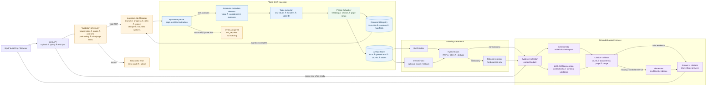

# CampusAI — Evidence-Grounded University Knowledge Assistant

## 1. Quyết định sản phẩm

Tên dự án chính thức: **CampusAI**.

Tên mô tả: **Evidence-Grounded University Knowledge Assistant**.

Slug repository/package: `campusai-evidence-rag` / `campusai`.

CampusAI là trợ lý hỏi đáp tri thức đại học. Người dùng tải lên các tài liệu có nguồn rõ ràng như quy chế đào tạo, chương trình đào tạo, đề cương học phần, sổ tay sinh viên, thông báo học vụ và bảng học phí. Hệ thống trích xuất nội dung, lập chỉ mục, trả lời bằng tiếng Việt hoặc tiếng Anh, luôn dẫn nguồn đến tài liệu/trang và từ chối khi không có đủ bằng chứng.

Phạm vi cốt lõi:

- học phần, mã môn, tín chỉ, học kỳ, điều kiện tiên quyết;
- quy chế, thời hạn đăng ký, điều kiện tốt nghiệp, thủ tục học vụ;
- so sánh chương trình hoặc quy định giữa các năm;
- truy vấn nhiều tài liệu và câu hỏi cần nối nhiều mảnh bằng chứng;
- bảng biểu có thể kiểm tra được, không để LLM tự đoán số liệu.

Không còn coi báo cáo tài chính là domain sản phẩm. Các fixture PDF và report
finance-only đã được xóa; khi cần đo lại Task 2, benchmark phải chạy trên corpus
đại học được cung cấp và review lại từ đầu.

## 2. Mục tiêu và tiêu chí hoàn thành

### Mục tiêu người dùng

Một sinh viên có thể mở website, tải 5–10 tài liệu của trường, chờ hệ thống xử lý nền, hỏi một câu tự nhiên và nhận được:

1. câu trả lời ngắn, rõ, đúng phạm vi tài liệu;
2. citation dạng `[Tên tài liệu, trang N]` cho từng kết luận quan trọng;
3. đoạn trích/preview để kiểm tra ngay;
4. nhãn thời gian hoặc phiên bản tài liệu;
5. câu trả lời “chưa đủ bằng chứng” khi không tìm thấy thông tin đáng tin cậy.

### Definition of Done

- Có website public chạy được bằng hạ tầng free-tier.
- Upload PDF text-based, hiển thị progress và trạng thái job.
- Parse, chunk, metadata, index và cache thành công.
- Tìm kiếm BM25 + dense; query đơn giản không phải chờ reranker nặng.
- Có chế độ rerank cho câu hỏi khó.
- LLM chỉ được trả lời từ context đã chọn, có citation và abstention.
- Có bộ benchmark university 100–300 câu hỏi, tách dev/test, không test trên corpus đã tune.
- Báo cáo Recall@k, MRR/nDCG, citation precision, groundedness, abstention precision, p50/p95 latency và chi phí/token.
- Có câu hỏi so sánh năm 2025/2026 và multi-hop trong benchmark.
- Có dashboard tối thiểu để xem tài liệu, câu hỏi, nguồn và điểm đánh giá.
- Deploy public bằng các dịch vụ free; có giới hạn abuse và không lưu secret trong repo.

## 3. Kiến trúc mục tiêu

```text
Browser
  │ upload / progress / chat / citations
  â–¼
Web app/API
  ├── rate limit + file validation + tenant/user quota
  ├── document registry + job status
  └── query router
        ├── easy: BM25 hoặc cache
        ├── normal: BM25 + dense + RRF
        └── hard: hybrid → cross-encoder rerank
  │
  ├── object storage: PDF, parsed markdown, tables, manifests
  ├── metadata DB: users, documents, versions, jobs, feedback
  └── background worker
        ├── validate PDF
        ├── PyMuPDF page extraction
        ├── academic metadata detection
        ├── structure-aware chunking + provenance
        ├── BM25 / dense index
        └── ready / failed / review-required
  │
  â–¼
Grounded answer service
  ├── evidence selection
  ├── citation validation
  ├── deterministic table/calculation path
  ├── LLM answer generation
  └── abstention if evidence is insufficient
```

### Sơ đồ hệ thống CampusAI

Sơ đồ dưới đây mô tả luồng chính từ lúc người dùng upload tài liệu đến khi nhận câu trả
lời có provenance. Nhánh `review_required` dừng trước indexing; chỉ tài liệu ở trạng thái
`ready` mới được phép truy vấn.


```mermaid
flowchart LR
    U[Người dùng / Browser]
    API[Web API<br/>Upload · Query · Poll job]
    SEC[Validation & Security<br/>Magic bytes · quota · rate limit<br/>path safety · size/page limits]
    JOB[Ingestion Job Manager<br/>Queue · progress · retry · cancel<br/>dedupe · bounded workers]

    subgraph ING[Phase 1 — Ingestion]
        PARSE[PyMuPDF parser<br/>page-level text extraction]
        META[Academic metadata detector<br/>value · confidence · evidence]
        TABLE[Table extractor<br/>raw values · headers · table ID]
        CHUNK[Phase 2 chunker<br/>heading · section · page range]
        PERSIST[(Document Registry<br/>SHA-256 · versions · manifests)]
        STORE[(Artifact Store<br/>PDF · parsed text · chunks · tables)]
        REVIEW[review_required<br/>ocr_required<br/>no indexing]
    end

    subgraph IDX[Indexing & Retrieval]
        BM25[BM25 index]
        DENSE[Dense index<br/>optional model / fallback]
        FUSION[Hybrid fusion<br/>RRF · filters · dedupe]
        RERANK[Optional reranker<br/>hard queries only]
    end

    subgraph ANSWER[Grounded answer service]
        EVIDENCE[Evidence selection<br/>context budget]
        VALIDATE[Citation validator<br/>chunk · document · page · range]
        TABLECALC[Deterministic table/calculation path]
        LLM[LLM JSON generation<br/>context-only · schema validation]
        ABSTAIN[Abstention<br/>insufficient evidence]
        RESP[Answer + citations<br/>source/page preview]
    end

    U --> API
    API --> SEC
    SEC -->|valid PDF| JOB
    SEC -->|invalid| ERR[Structured error<br/>error_code · action]
    JOB --> PARSE
    PARSE -->|text available| META
    PARSE -->|scan-only / parse risk| REVIEW
    META --> TABLE
    TABLE --> CHUNK
    CHUNK --> PERSIST
    CHUNK --> STORE
    PERSIST -->|ingestion complete| JOB
    STORE --> BM25
    STORE --> DENSE
    BM25 --> FUSION
    DENSE --> FUSION
    FUSION -->|normal query| EVIDENCE
    FUSION -->|hard query| RERANK --> EVIDENCE
    API -->|query only when ready| EVIDENCE
    EVIDENCE --> TABLECALC
    EVIDENCE --> LLM
    TABLECALC --> VALIDATE
    LLM --> VALIDATE
    VALIDATE -->|valid evidence| RESP
    VALIDATE -->|missing / invalid evidence| ABSTAIN
    ABSTAIN --> RESP
    RESP --> U

    classDef phase1 fill:#e8f3ff,stroke:#2878b5,color:#12344d;
    classDef phase2 fill:#eef9ee,stroke:#3b8f4c,color:#183d20;
    classDef safety fill:#fff4df,stroke:#c27a00,color:#4d3100;
    classDef answer fill:#f3eaff,stroke:#8355b5,color:#32184d;
    class SEC,JOB,REVIEW,ERR safety;
    class PARSE,META,TABLE,PERSIST,STORE phase1;
    class CHUNK phase2;
    class EVIDENCE,VALIDATE,TABLECALC,LLM,ABSTAIN,RESP answer;
```

#### Các invariant quan trọng trong sơ đồ

| Điểm kiểm soát | Invariant nghiệm thu |
|---|---|
| Validation | File không hợp lệ bị chặn trước khi parse; không tin filename để xác định PDF. |
| Ingestion | Job có progress/stage/error; retry idempotent; dedupe theo SHA-256. |
| Scan/OCR | Scan-only kết thúc `review_required/ocr_required`, không sinh chunk/index. |
| Chunking | `len(chunk.content) <= _MAX_CHARS`; heading path, page range và table boundary được giữ. |
| Persistence | Registry/artifact có source hash, parser/chunker/schema version và có thể delete đầy đủ. |
| Retrieval | Chỉ tài liệu `ready` được truy vấn; hybrid/reranker không làm mất provenance. |
| Answer | Citation phải trỏ đến evidence tồn tại và page hợp lệ; nếu không thì abstain. |

### Các quyết định kỹ thuật đã chốt

1. **Parser mặc định là PyMuPDF.** Đây là đường nhanh cho PDF có text, hiện đã có cache SHA-256, progress theo trang và kiểm tra scan. Docling chỉ chạy trong explicit review job cho layout/table khó; không dùng cho request thông thường.
2. **Retrieval mặc định là `hybrid`.** `BM25 + dense + RRF` đủ nhanh cho web free. `hybrid_rerank` là chế độ opt-in cho câu hỏi khó, giới hạn tối đa 8 candidate.
3. **Model phải load một lần mỗi process.** Runtime singleton và LRU query cache được giữ lại; không load encoder/reranker trong mỗi request.
4. **Reranker không nằm trên free web request path.** CPU reranker hiện có peak memory khoảng 4.5 GB và load khoảng 56 giây trên máy benchmark; chỉ dùng worker có RAM phù hợp hoặc bật theo feature flag.
5. **Không đưa Knowledge Graph vào MVP.** Chỉ triển khai sau khi benchmark chứng minh hybrid/multi-hop chưa giải quyết được quan hệ prerequisite hoặc version.
6. **Không thêm framework RAG nặng ở giai đoạn đầu.** Các component hiện tại minh bạch, dễ benchmark và đã có test; có thể học pattern ingestion/index/store của LlamaIndex hoặc Haystack sau khi có nhu cầu, nhưng không đổi framework chỉ vì xu hướng.
7. **FAISS là hướng scale-up, không bắt buộc ở MVP.** Corpus nhỏ dùng index hiện tại để giảm dependency và cold start; khi vector count tăng, benchmark FAISS với cosine bằng normalized inner product trước khi chuyển.

## 4. Code hiện tại: giữ lại, sửa và xây mới

### Giữ lại và tái sử dụng trực tiếp

| Thành phần | Giá trị với CampusAI |
|---|---|
| `src/campusai/ingestion/validate.py` | giới hạn file/trang, nhận diện PDF scan, lỗi rõ ràng |
| `docling_parser.py` / PyMuPDF path | parse page-level nhanh, giữ số trang và progress |
| `table_extractor.py` | bảng có schema, raw preservation, cảnh báo không phá dữ liệu |
| `chunker.py` | chunk theo heading/page/table, kế thừa metadata và provenance |
| `documents/registry.py` | đăng ký tài liệu, cache theo hash, tránh ingest lặp |
| `ingestion/jobs.py` | background job, retry, dedupe, bounded executor, progress |
| `retrieval/bm25.py`, `dense_index.py`, `fusion.py`, `hybrid.py` | nền tảng retrieval nhanh, RRF, filter theo document |
| `retrieval/model_runtime.py` | singleton encoder/reranker, tránh cold load lặp |
| `llm/client.py`, `cache.py`, `rate_limiter.py`, `factory.py` | provider-neutral client, cache, retry/backoff, giới hạn request |
| `evaluation/`, `scripts/validate_benchmark.py` | khung đánh giá và kiểm tra benchmark |
| Task 2 benchmark/tests | engine đánh giá parser/retrieval có thể chạy lại trên corpus đại học |

### Đối chiếu riêng với Task 1 cũ

Task 1 cũ không bị bỏ đi và không cần viết lại từ đầu. Nó trở thành lớp gọi
LLM dùng chung cho CampusAI:

- `client.py`: giữ nguyên transport Gemini/OpenAI-compatible, `complete`,
  `generate`, `generate_json`, phân loại lỗi và retry;
- `cache.py`: giữ SQLite cache, response metadata và single-flight ở client;
- `rate_limiter.py`: giữ giới hạn request và backoff;
- `factory.py`: giữ cấu hình provider, environment-only secret và fallback YAML;
- `tests/test_llm*.py`, `tests/integration/test_gemini.py`: giữ làm acceptance
  contract, chỉ đổi import namespace `finrag` → `campusai`;
- `docs/t1_acceptance.md`: giữ làm báo cáo acceptance, cập nhật tên sản phẩm;
- `rag/grounding.py` mới dùng trực tiếp `generate_json` của Task 1 để trả về
  answer/citations/abstention; LLM không được bypass citation validator.

Không đưa API key, cache response hoặc provider-specific payload vào layer
retrieval. Nếu sau này đổi Gemini sang provider free khác, chỉ factory/client
được thay; ingestion, retrieval và citation contract không đổi.

### Đã sửa để phù hợp domain mới

- Đổi package từ `finrag` thành `campusai`; đổi project/lock metadata thành `campusai-evidence-rag`.
- Đổi metadata detector từ tài chính-only thành academic: `domain`, `document_type`, `academic_years`, `years`, `semesters`, `language`, `currency` và `units` dùng cho học phí/tín chỉ.
- Xóa các alias tài chính-only như `fiscal_years` và `consolidation`; benchmark finance cũ đã được dọn khỏi repository.
- Đổi table schema để mang metadata academic, không còn field tài chính-only.
- Đổi numeric normalizer thành parser số dùng chung cho tín chỉ, học phí, phần trăm và bảng; không tự đoán đơn vị.
- Đổi warm-up query sang prerequisite/semester.
- Đổi `data/benchmark/dev.jsonl` thành seed benchmark university gồm fact, table, calculation, comparison và multi-hop.
- Đổi `configs/default.yaml` có app domain, quota web và tên CampusAI.

### Chưa cần thay đổi

- Contract `Document`, `Chunk`, `Table`: provenance hiện tại đúng với citation.
- SHA-256 cache, page number, `content_type`, heading path.
- Fallback dense deterministic cho môi trường không có model.
- LLM transport, schema validation, retry và cache vì đây là hạ tầng dùng chung.
- giới hạn benchmark Task 2 50 MB/218 trang; đây là giới hạn đo năng lực, không phải quota public web.

### Phải xây thêm

1. `academic_metadata` chuẩn hóa institution/program/course/academic-year/version/effective-date; trường nào không có bằng chứng thì để `null`.
2. Answer pipeline có prompt grounding, context budget, citation validator và abstention policy.
3. Temporal resolver: chọn bản hiện hành theo `effective_date`, trả lời so sánh khi user hỏi “khác gì giữa năm X/Y”.
4. Multi-document retrieval và evidence set để không trộn nhầm hai chương trình.
5. Deterministic table/calculation executor cho tín chỉ, tỷ lệ, học phí; LLM chỉ diễn giải kết quả.
6. Web UI/API, storage adapter, authentication nhẹ, quota, health check và job polling.
7. Evaluation dashboard, feedback “citation đúng/sai”, trace latency theo từng stage.

## 5. Lộ trình triển khai theo phase

### Phase 0 — Đổi tên, contract và baseline

Trạng thái: **đang thực hiện**.

- hoàn tất tên CampusAI, package `campusai`, README và plan này;
- chạy import scan không còn `finrag` trong code production;
- giữ Task 2 artifacts để regression;
- tạo `ARCHITECTURE.md`, `.env.example`, policy dữ liệu.

Exit criteria: test suite pass; import public là `campusai.*`; benchmark validator pass.

### Phase 1 — Ingestion đại học (10/10 gate)

#### Chiến lược đã chọn

Phase 1 dùng pipeline deterministic-first: PyMuPDF cho PDF text-based là đường mặc định,
Docling/OCR chỉ là nhánh review opt-in cho tài liệu khó. Không gọi LLM để parse metadata,
không index tài liệu chưa đạt validation, và không coi fixture sinh tự động là corpus thật.
Mỗi tài liệu được xử lý qua một job idempotent, có registry, version, provenance và trạng
thái rõ ràng. Đây là lựa chọn tối ưu cho free-tier vì giảm cold start, chi phí và bề mặt lỗi,
đồng thời vẫn mở đường cho OCR/layout parser ở worker riêng.

#### Contract đầu vào và corpus nghiệm thu

- [ ] Có tối thiểu **5 PDF đại học thật**, ưu tiên UET/VNU; corpus phải đa dạng loại/layout
  và không dùng synthetic fixture để thay thế coverage thật.
- [ ] Corpus bao phủ regulation, curriculum, syllabus, handbook, course catalog, tài liệu
  nhiều trang, tài liệu có bảng, tiếng Việt có dấu, tiếng Anh/song ngữ và ít nhất hai
  phiên bản/năm khác nhau.
- [ ] Có `supplied_real_corpus`, `generated_test_fixtures` và `holdout_corpus` tách biệt.
- [ ] Mỗi PDF có manifest gồm tên, nguồn, năm, số trang, loại tài liệu, ngôn ngữ,
  SHA-256 và trạng thái quyền sử dụng; corpus và manifest được version/hash trong report.
- [ ] Holdout không được dùng để tune parser/chunker; acceptance phải chạy được từ workspace
  sạch và không đọc dữ liệu ngoài repository mà không khai báo.

#### Pipeline và lifecycle bắt buộc

Trạng thái canonical:

```text
queued → validating → parsing → detecting_metadata → extracting_tables
       → chunking → persisting → indexing → succeeded
       ↘ review_required / failed / cancelled
```

- [ ] Mỗi stage có `started_at`, `finished_at`, progress, duration và error có cấu trúc:
  `error_code`, `message`, `stage`, `retryable`, `action`.
- [ ] Tách rõ `ingestion_complete` và `index_ready`; scan-only không được gắn
  `succeeded` hoặc đưa vào index.
- [ ] Retry chỉ dành cho lỗi retryable, có backoff/idempotency key và không tạo bản ghi,
  file, chunk hay index trùng.
- [ ] Có cancel an toàn, cleanup khi fail/cancel, bounded worker theo CPU/RAM, và phục hồi
  registry sau process restart.
- [ ] Concurrent upload cùng SHA-256 được dedupe; hai file khác nhau cùng filename vẫn
  được lưu độc lập.

#### Validation và an toàn file

- [ ] Kiểm tra PDF magic bytes/signature, không tin filename/suffix; giới hạn file size,
  page count, tổng text/table size và thời gian parse.
- [ ] Upload root được cô lập; filename được normalize; chặn path traversal, symlink và
  đường dẫn ngoài root.
- [ ] Từ chối hoặc chuyển review đối với PDF rỗng, hỏng, encrypted, scan-only và
  decompression bomb; có memory guard và timeout.
- [ ] Temporary files luôn được dọn sau success/fail/cancel; log không chứa toàn bộ nội
  dung tài liệu nhạy cảm.
- [ ] Có test cho file giả, file hỏng, encrypted, file quá lớn, zip/decompression abuse,
  symlink/path traversal và timeout.

#### Metadata học thuật có bằng chứng

Detector phải trả về schema ổn định cho `institution`, `faculty/school`, `program`,
`course`, `course_code`, `document_type`, `academic_year`, `semester`, `version`,
`effective_date`, `issue_date`, `language`. Mỗi field có thể có:

```json
{
  "value": "Kỹ thuật Cơ điện tử",
  "confidence": 0.92,
  "evidence": "Chương trình đào tạo ngành Kỹ thuật Cơ điện tử",
  "source_page": 1
}
```

- [ ] Không suy diễn field khi thiếu bằng chứng: trả `null`, confidence thấp và warning.
- [ ] Regex/context phân biệt tên chương trình với số tín chỉ; `155 tín chỉ` không được
  nhận là `program`.
- [ ] Ưu tiên bìa, quyết định ban hành, header/footer có kiểm soát; hỗ trợ tiếng Việt có
  dấu/không dấu và tiếng Anh.
- [ ] Có unit test positive/negative cho từng field và integration test trên toàn corpus;
  không có metadata nghiêm trọng sai trên holdout.

#### Scan/OCR và persistence

- [ ] Scan-only trả `review_required` với error code `ocr_required`, không gọi LLM và
  không index text rỗng.
- [ ] OCR là background job opt-in, có page/time/cost limit và test cho PDF scan một trang,
  nhiều trang và PDF trộn text/image; Phase 1 không phụ thuộc OCR production để pass.
- [ ] Registry dedupe theo SHA-256 nhưng vẫn lưu source metadata, ingestion config,
  parser/chunker/schema version; pipeline version khác không ghi đè artifact cũ.
- [ ] Delete document xóa PDF, parsed text, chunks, tables, index, cache và metadata;
  có TTL/cache cleanup và test xác nhận xóa thật.

#### Definition of Done Phase 1

- [ ] Corpus thật tối thiểu đạt coverage: ít nhất 5 PDF, tối thiểu 3 loại tài liệu,
  có tài liệu nhiều trang, có bảng, có tiếng Việt/Anh nếu scope hỗ trợ, và có ít nhất
  một PDF scan hoặc layout lỗi; report phân biệt real corpus/fixtures/holdout.
- [ ] Mọi chunk hợp lệ có `doc_id`, source, page/page range, `content_type`, source hash,
  parser/chunker version và citation; scan không làm worker treo.
- [ ] Job progress/retry/dedupe/cancel/cleanup/restart pass integration/concurrency tests.
- [ ] Validation, metadata evidence, registry, delete/TTL và security scan không còn P0/P1.
- [ ] Acceptance report được regenerate từ code hiện tại; không được sửa tay để biến fail
  thành pass.
- [ ] Sửa `scripts/validate_ingestion.py` để acceptance dùng coverage gate thực tế; fixture
  chỉ được báo riêng cho regression, không thay thế corpus thật. Report phải có holdout
  và phải fail closed khi regression test tương ứng fail.

### Phase 2 — Chunking và cấu trúc (10/10 gate)

#### Chiến lược đã chọn

Phase 2 dùng structure-aware chunking với section làm đơn vị ngữ nghĩa, page provenance
làm đơn vị citation, và table là content type độc lập. Heading được nhận diện bằng rule
deterministic có normalization Unicode; không dùng LLM để đoán section. Mọi chunk phải
đạt invariant trước khi persist: kích thước tuyệt đối, section boundary đúng, provenance
đủ và citation mở được đúng trang.

#### P0: golden fixtures và section correctness

- [ ] Golden `Điều kiện tốt nghiệp` và `Học phần tiên quyết` pass trên các biến thể: viết
  hoa, đánh số, dấu câu, heading bị tách dòng và heading kéo qua trang.
- [ ] Golden test xác nhận đúng heading, section, page, page range, citation và nội dung;
  không ăn sang section kế bên. Bắt buộc pass:
  `test_graduation_golden_fixture_keeps_section_and_citation_page`.
- [ ] Heading tiếng Việt có dấu được giữ nguyên bản gốc; normalized form dùng cho search
  (`ĐIỀU KIỆN` → `dieu kien`) nhưng không làm mất numbering.
- [ ] Mục lục, header/footer, tên bảng, câu viết hoa dài và mã học phần phải được loại
  khỏi heading bằng context/page-frequency/numbering checks.

#### Heading và section inheritance

- [ ] Hỗ trợ Markdown, `1/1.1/1.1.1`, `Điều/Khoản/Mục/Chương`, `Article/Section/Chapter`,
  heading có `: . -`, heading qua dòng và qua trang.
- [ ] Heading record có `text`, `normalized`, `level`, `source_page`, `confidence`.
- [ ] `heading_path` kế thừa đúng document → page → section → chunk; heading cấp thấp
  không làm mất cấp cao, heading mới chỉ thay level tương ứng.
- [ ] Section tiếp tục đúng qua page break; không gán text trước heading vào section sau;
  page range và nested headings phải chính xác.
- [ ] Có test section liền kề, nested headings, heading cuối trang, bảng xen giữa section
  và tài liệu layout hỗn hợp.

#### Chunk-size invariant và overlap

- [ ] Tính budget sau khi biết context header: `body_budget = MAX_CHARS - header_len -
  safety_margin`; áp dụng cho text và table.
- [ ] Final guard chạy sau khi ghép header/content/overlap; nếu vượt thì split lại cho đến
  khi `len(final_chunk.content) <= _MAX_CHARS`.
- [ ] Unicode được đo ổn định; overlap không được làm chunk vượt giới hạn; input hợp lệ
  luôn có `diagnostics["chunks_over_limit"] == []`.
- [ ] Chỉ ghi overflow khi một đơn vị không thể chia nhỏ hơn, kèm warning và reason rõ ràng;
  không dùng `allowed_margin` để che lỗi splitter.

#### Table chunk contract

- [ ] Mỗi table là chunk độc lập, giữ raw values, header đầy đủ, `table_id` ổn định,
  section path, source, page range và `content_type="table"`.
- [ ] Table nhiều trang được nối đúng, lặp header khi cần, không trộn với section kế tiếp;
  không tự diễn giải/normalize làm mất dữ liệu.
- [ ] Schema tối thiểu: `headers`, `rows`, `units`, `page`, `page_range`, `table_id`,
  `section`, `source`; test cột không đều, ô trống, merged cells, thiếu header và split
  nhiều trang. Bắt buộc pass:
  `test_prerequisite_golden_fixture_preserves_table_header_and_section_boundary`.

#### Provenance, citation và metric

- [ ] Mọi chunk có `doc_id`, source name, page, page range, content type, chunk ID,
  heading path, table ID nếu có, parser/chunker version và source hash.
- [ ] Citation validator kiểm tra chunk/document tồn tại, page/page range hợp lệ, table ID
  tồn tại và không trỏ vào chunk đã xóa; test end-to-end:
  `query → retrieved chunk → citation → source document/page`.
- [ ] Báo cáo corpus thật có chunk count/document, min/mean/p50/p95/max length, overflow,
  overlap, duplicate rate, thiếu heading/citation, sai page range, section boundary failure
  và table mất header.

#### Definition of Done Phase 2

- [ ] Hai golden fixture pass; chunk overflow bằng 0 trên corpus hợp lệ.
- [ ] Không mất heading, numbering, section path, table header/id hoặc page range; không
  trộn section liền nhau.
- [ ] Citation validator pass 100%; mọi chunk có provenance đầy đủ.
- [ ] Metric report trên corpus thật và holdout có version/hash; layout thực tế, bảng nhiều
  trang, font lỗi, page rỗng và heading tách dòng đều có test.
- [ ] Acceptance JSON, test runtime, tài liệu và code không còn mismatch.

### Phase 1/2 acceptance gate chung

Chỉ đóng Phase 1 và Phase 2 khi tất cả lệnh sau cùng pass trong workspace sạch:

```powershell
.\.venv\Scripts\python.exe -m pytest -q
.\.venv\Scripts\python.exe scripts\validate_ingestion.py --input-dir data\corpus\university --holdout data\corpus\university\uet_admission_2025.pdf --output evaluation\ingestion_acceptance.json
.\.venv\Scripts\python.exe scripts\secret_scan.py
.\.venv\Scripts\python.exe -m compileall -q src scripts tests
.\.venv\Scripts\python.exe scripts\benchmark_t2.py --input-dir data\corpus\university --output evaluation\t2_results.json --holdout data\corpus\university\uet_admission_2025.pdf --run-docling --docling-max-pages 30 --run-models --device cpu --batch-size 2 --repeats 1 --model-text-count 8 --memory-budget-mb 8192
.\.venv\Scripts\python.exe scripts\create_t2_table_review.py evaluation\t2_results.json --output evaluation\t2_table_review.json --complete
.\.venv\Scripts\python.exe scripts\validate_t2.py evaluation\t2_results.json --acceptance --review evaluation\t2_table_review.json
```

Acceptance report phải được tạo lại từ runtime hiện tại và phải fail closed: nếu regression
test tương ứng fail, report không được ghi nhận `true`. Release note phải ghi commit/version,
Python/OS/package versions, parser/chunker version, corpus hash, holdout hash và thời gian
chạy. Bất kỳ P0/P1 security, reliability, provenance hoặc reproducibility nào còn mở đều
giữ phase ở trạng thái chưa đạt.

### Phase 3 — Embedding và vector search

- dùng fallback hash cho test/dev không tải model;
- production benchmark một embedding model multilingual nhẹ;
- persist index theo corpus/version, không build lại mỗi query;
- thêm FAISS chỉ khi benchmark corpus vượt ngưỡng hiện tại.

Exit criteria: Recall@5 và p95 query được ghi theo từng corpus; restart process không mất index.

### Phase 4 — Basic RAG

- lấy top-k context, dựng prompt tiếng Việt/Anh;
- trả lời ngắn và nêu rõ document/page;
- cache câu hỏi giống nhau theo corpus version;
- context budget không vượt giới hạn model/provider.

Exit criteria: câu hỏi fact có answer/evidence; câu ngoài corpus không được bịa.

Phase 4 acceptance: completed with bilingual prompts, provenance-preserving
context/token budgets, versioned query-answer cache, deterministic abstention
tests and offline report in `evaluation/results/basic_rag_report.json`.

### Phase 5 — Citation, grounding và abstention

- output schema bắt buộc `answer`, `citations`, `confidence`, `abstained`;
- citation phải trỏ đến chunk tồn tại và page hợp lệ;
- claim không có evidence bị loại hoặc chuyển thành abstention;
- phân biệt “không tìm thấy” với “tài liệu không đề cập”.

Exit criteria: citation precision và abstention precision được đo tự động trên test set.

### Phase 6 — BM25 + hybrid + RRF

- query routing: exact code/course trÆ°á»›c, hybrid sau;
- filter theo document/program/year khi người dùng chọn;
- normalize score, RRF, dedupe chunk và giới hạn candidate;
- đo latency riêng BM25, dense, fusion.

Exit criteria: hybrid thắng từng retriever đơn trên Recall@k mà p95 vẫn phù hợp free CPU.

### Phase 7 — Reranker

- chỉ rerank top 8–20 candidate trong worker hoặc route hard;
- warm một lần lúc startup; không load trong callback người dùng;
- có circuit breaker/fallback về hybrid khi thiếu RAM/timeout;
- ghi `reranker_used` và latency vào trace.

Exit criteria: reranker cải thiện nDCG/citation precision đủ lớn để biện minh chi phí.

### Phase 8 — Evaluation và benchmark

Tối thiểu 100–300 câu hỏi do người tạo và review, phân phối:

- 30% fact/definition;
- 20% table/filter/calculation;
- 20% prerequisite/multi-hop;
- 15% temporal/comparison;
- 15% unanswerable/ambiguous/adversarial.

Đo Recall@3/5/10, MRR hoặc nDCG, answer exact/semantic, citation precision/recall, groundedness, abstention precision/recall, p50/p95 end-to-end, peak RAM và cache hit. Có ablation: BM25-only, dense-only, hybrid, hybrid+rerank, có/không metadata filter.

Exit criteria: có report versioned; mọi tối ưu sau đó phải không làm xấu answer/citation metrics.

### Phase 9 — Temporal RAG

- version document theo academic year/effective date;
- query “hiện hành”, “năm 2025”, “khác gì” phải chọn đúng version;
- citation hiển thị ngày hiệu lực và trạng thái superseded;
- không merge hai phiên bản nếu user không yêu cầu comparison.

### Phase 10 — Multi-document và multi-hop

- evidence set có `doc_id` và role cho từng hop;
- truy vấn course → prerequisite → rule → answer;
- tách retrieval của từng document rồi mới fusion khi cần;
- đánh giá contamination giữa các chương trình.

### Phase 11 — Knowledge Graph (deferred)

Chỉ làm khi Phase 8 cho thấy lỗi còn lại chủ yếu là quan hệ entity, không phải retrieval/citation. Schema dự kiến: `Course`, `Program`, `Prerequisite`, `Semester`, `Regulation`, `EffectiveDate`. Không xây graph trước benchmark.

### Phase 12 — Web app

- dashboard tài liệu: upload, loại tài liệu, version, trạng thái, lỗi;
- progress job và nút retry/review;
- chat vá»›i source cards, page preview, copy citation;
- filter program/year/semester;
- feedback citation đúng/sai;
- giới hạn file, user, concurrency và câu hỏi/phút.

### Phase 13 — Deploy free

MVP public nên tách:

- **Streamlit Community Cloud** cho UI/demo nhẹ;
- storage/database free-tier cho metadata và PDF nhỏ;
- worker CPU riêng hoặc Hugging Face Space nếu cần process dài;
- LLM provider free quota với cache bắt buộc;
- không tải BGE-m3/reranker nặng trong Streamlit request path.

Nếu chỉ dùng một service để demo, chấp nhận giới hạn: tài liệu nhỏ, một worker, queue ngắn, không đảm bảo SLA. Tài liệu lớn và OCR không nên chạy đồng bộ trong web request.

### Phase 14 — Production polish

- structured logs, request/job id, stage timings;
- health/readiness check và graceful shutdown;
- secret từ platform environment, không commit API key;
- xóa file theo TTL, privacy notice, export/delete user data;
- smoke test sau deploy, rollback image, backup manifest;
- README deploy một lệnh và public demo URL.

## 6. Hạ tầng free được chọn

| Nhu cầu | Lựa chọn MVP | Giới hạn cần chấp nhận |
|---|---|---|
| UI | Streamlit Community Cloud | tài nguyên khoảng 2 core/2.7 GB RAM/50 GB; phù hợp demo nhẹ |
| Worker/model nặng | Hugging Face Spaces CPU hoặc Space phù hợp | cold start và quota; GPU free không mặc định đảm bảo |
| File | local ephemeral cho demo hoặc Cloudflare R2 | free tier có quota; cần TTL và giới hạn upload |
| Metadata | Supabase Postgres | free project có quota; không lưu embedding khổng lồ vô hạn |
| LLM | free-tier provider, mặc định Gemini-compatible adapter | RPM/TPM/RPD thay đổi; phải cache và rate-limit |
| Vector | file index trong artifact/storage | rebuild theo corpus version; FAISS khi scale |

Các giới hạn trên phải được kiểm tra lại lúc deploy vì free-tier thay đổi theo thời gian. Không hứa “miễn phí vô hạn” hay SLA production.

## 7. Thứ tự việc phải làm ngay

1. Hoàn tất import/namespace scan và chạy toàn bộ test sau rename.
2. Thêm test academic metadata và test table schema mới.
3. Thêm `answer/grounding/citation` module, chưa cần UI.
4. Tạo corpus university nhỏ có bản 2025/2026 và 20–30 câu hỏi vàng.
5. Kết nối answer pipeline với `HybridRetriever` ở mode fast.
6. Đo baseline answer/citation/latency; sau đó mới bật reranker.
7. Tạo web app tối thiểu upload → job → chat → citation.
8. Deploy demo free; giới hạn quota trước khi chia sẻ public.
9. Mở rộng benchmark lên 100–300 câu hỏi và tạo evaluation dashboard.

## 8. Nguồn tham khảo kỹ thuật

- [Microsoft MarkItDown](https://github.com/microsoft/markitdown): tham khảo mô hình converter pipeline và optional dependencies; không dùng thay parser layout chính.
- [FAISS](https://github.com/facebookresearch/faiss): tham khảo dense similarity search và lựa chọn index khi corpus lớn.
- [LlamaIndex ingestion](https://docs.llamaindex.ai/en/stable/module_guides/loading/ingestion_pipeline/): tham khảo pipeline loader → transformations → index/store và metadata lineage.
- [Haystack ranker](https://docs.haystack.deepset.ai/docs/ranker): tham khảo vị trí reranker sau retriever và trade-off latency.
- [Jmhzbmcn2/med_rag](https://github.com/Jmhzbmcn2/med_rag): tham khảo API chat/health,
  source cards (`title`, `section`, `text`, `score`), giới hạn input, fallback khi
  reranker lỗi, context header cho chunk và metric retrieval theo loại tài liệu.
- [Hugging Face Spaces](https://huggingface.co/docs/hub/spaces-overview): tham khảo hardware/deployment options.
- [Streamlit Community Cloud](https://docs.streamlit.io/deploy/streamlit-community-cloud/manage-your-app): tham khảo giới hạn tài nguyên khi chọn route free.

Các repo trên là nguồn học pattern. CampusAI giữ code path nhỏ, có benchmark và provenance riêng thay vì sao chép nguyên framework.
## 9. Phase 1/2 regenerated acceptance evidence

- Full suite: 71 passed, 1 skipped (live Gemini integration requires an external secret).
- Phase 1/2 acceptance: all 16 exit criteria are true in `evaluation/ingestion_acceptance.json`.
- Corpus: 8 real UET/VNU PDFs with manifest SHA-256, a declared holdout, Vietnamese/English, scan/image, and mixed-layout coverage.
- Provenance validator: fail-closed checks for chunk/document/page/page-range/table/source hash; delete and lifecycle checks pass.
- T2 report: schema-2 extended report, Docling comparison, model benchmark and completed table review all validate with `scripts/validate_t2.py --acceptance`.
- OCR policy: scan-only inputs use the bounded RapidOCR ONNX worker when explicitly enabled; default ingestion remains fail-closed with `review_required/ocr_required`.
